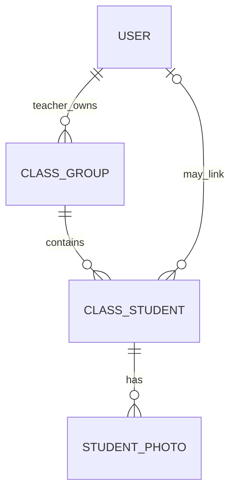
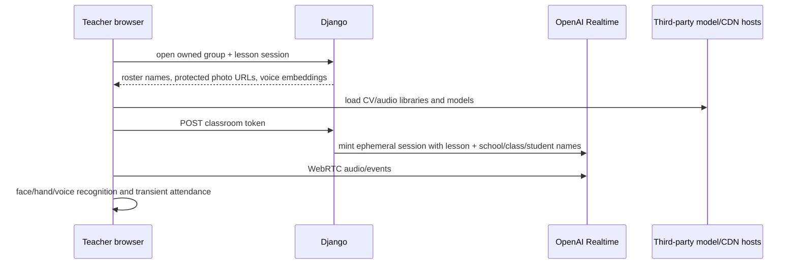

# Classroom architecture

Status: **tracked on `main`, experimental/partially implemented, not production-ready**. The former claim that classroom was uncommitted local WIP was obsolete as of the 2026-07-10 audit.

Read this with [architecture](docs/ARCHITECTURE_AND_CODEBASE.md), [AI integrations](docs/AI_INTEGRATIONS.md), [security](docs/SECURITY_AUDIT.md), and [UX audit](docs/UX_UI_AUDIT.md).

## Implemented scope

- Any profile whose role is `teacher` can create owned groups and student rosters.
- Teachers can upload student photos and save browser-derived voice embeddings.
- With active voice access, a teacher can select any lesson and open a live page.
- The browser loads face/hand/voice libraries/models, opens camera/microphone, matches enrolled students, and sends control-style messages into an OpenAI Realtime session.
- Photos are served through an owner-filtered Django view; production media mapping can still bypass that protection if all `MEDIA_ROOT` is served publicly.

There is no persistent classroom session, attendance, outcome, correction, consent, guardian, retention, or audit model.

## Files

| Path | Responsibility |
| --- | --- |
| `lessons/models.py` | `ClassGroup`, `ClassStudent`, `StudentPhoto`, profile role, face/voice embedding fields |
| `lessons/forms_classroom.py` | Group/student/photo/session forms |
| `lessons/views_classroom.py` | Ownership guards, CRUD, protected photo response, embedding save, session context, token mint |
| `lessons/templates/lessons/classroom/` | Dashboard, setup, roster, enrollment, session UI |
| `static/js/classroom-lesson.js` | Live camera/face/hand/voice/OpenAI runtime |
| `static/js/classroom-voice-enroll.js` | Standalone voice enrollment on group page |

## Data and ownership

`ClassStudent.user` is a nullable `ForeignKey`: each roster row can link to zero or one `User`, while one `User` can link to multiple `ClassStudent` rows. View queries consistently filter groups/students/photos by `group__teacher=request.user`. `Confirmed / High`. Teacher eligibility itself is unsafe because the role is self-selected publicly (`SEC-010`).

## Runtime flow

Recognition thresholds and model endpoints are configured in the session template/client. Runtime dependencies include direct CDN and model-host downloads without SRI/package locking.

## Privacy and safety blockers

- No verified teacher/school relationship.
- No age/guardian/biometric consent or opt-out record.
- No individual photo deletion route; FileField deletion lifecycle is incomplete.
- No voice-embedding deletion UI or data-access audit.
- Student/school/class names are sent to OpenAI instructions.
- Camera/audio disclosures and retention choices are incomplete.
- Production private-media access is not established.
- The active privacy policy omits material classroom processing.
- No accuracy evaluation or manual correction record for attendance/identity.
- Any teacher can store unbounded total photos/students subject only to ten files per form submission.

Do not market or deploy recognition to learners/minors until `SEC-007` and `SEC-010` acceptance criteria are satisfied.

## Modification rules

- Preserve owner filters and add negative cross-teacher tests.
- Default recognition off; do not collect more biometric data by convenience.
- Never send raw photos/embeddings or additional identifiers to an external model without approved necessity and consent.
- Add file size/dimension/type limits and atomic storage behavior.
- Treat browser recognition as probabilistic; persist corrections, not silent certainty.
- Test mobile/browser permissions, unavailable CDNs/models, accessibility, and a no-recognition path.

See feature opportunity `FEAT-008` for the proposed consent-safe session/report MVP.
