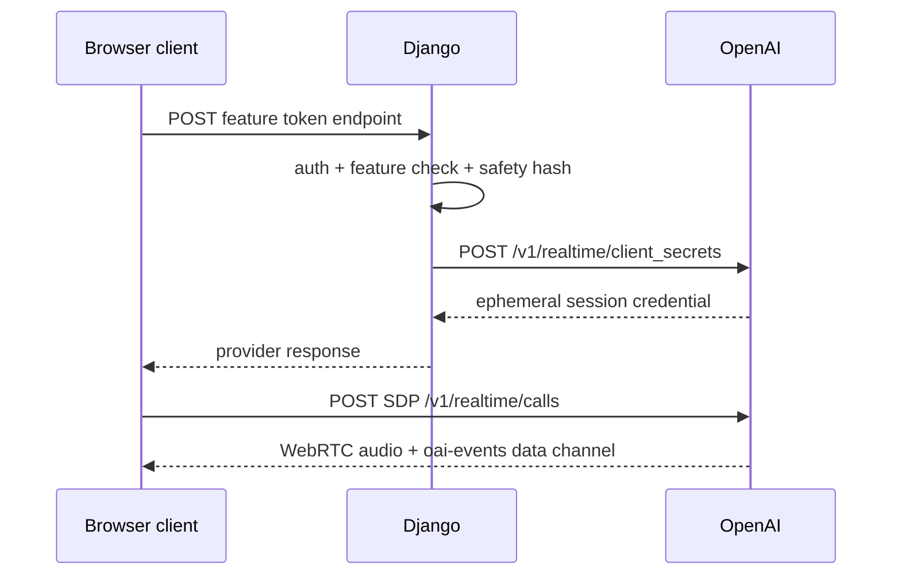
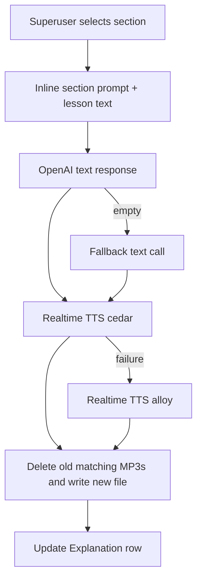
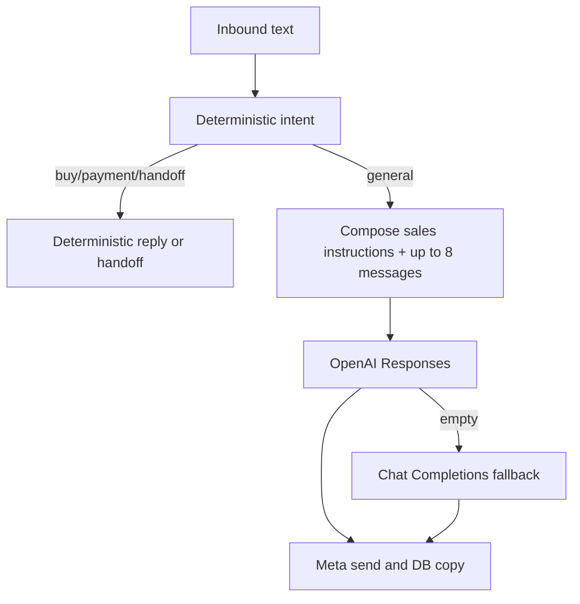
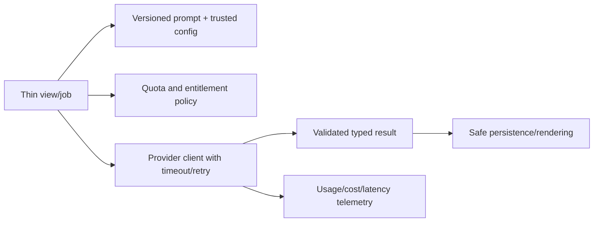

# AI integrations

Audit snapshot: 2026-07-10. Provider behavior and pricing were not tested live. Model names below are code configuration, not proof of current availability or suitability.

## Inventory

| Feature | Entry point | Model/config source | Input | Output/persistence | Access |
| --- | --- | --- | --- | --- | --- |
| Lesson explanation text | `lessons.views.explain_section` | Inline `gpt-5.5`, fallback `gpt-5` | One lesson section inside inline prompt | `Explanation.text` | Superuser POST |
| Explanation speech | same view → `synthesize_audio_realtime_mp3` | `REALTIME_MODEL`, `cedar` then `alloy` | Generated explanation text | MP3 in `MEDIA_ROOT`, URL string in `Explanation` | Superuser triggers; learners read |
| Lesson chat | `lessons.views.chat_with_gpt` | Inline `gpt-5.5` | Lesson fields + arbitrary question | Browser JSON only | Public POST; no entitlement/quota |
| Motivation | `lessons.views.motivational_message` | Inline `gpt-5.5` | Static prompt | Browser JSON only | Public POST; no quota |
| Individual Realtime voice | `mint_realtime_token` + `voice-lesson.js` | `REALTIME_MODEL` | Current pre-existing WIP uses `_content_creator_instructions`; selected lesson is not included | Direct WebRTC audio/text; no server transcript record | Auth + active voice access |
| Translator Realtime | `mint_translator_token` + `translator-assistant.js` | `REALTIME_MODEL` | Inline interpreter prompt + microphone audio | Direct WebRTC audio/text | Auth + active translator access |
| Classroom Realtime | `mint_realtime_classroom_token` + `classroom-lesson.js` | `REALTIME_MODEL` | Lesson, school/class, student names, browser events, microphone audio | Direct WebRTC; runtime-only attendance/recognition | Teacher + voice + owned group |
| WhatsApp sales reply | `whatsapp_agent.services.generate_sales_reply` | env/settings or `gpt-5` default | Up to eight recent messages plus sales prompt | Outbound WhatsApp message and DB copy | Triggered by webhook |
| Receipt OCR | `whatsapp_agent.utils` | Tesseract/PDF parser, not an LLM | Downloaded receipt image/PDF | Extracted text and heuristic fields in DB | Triggered by webhook |
| Legacy helper | `lessons/chatgpt_helper.py` | Inline `gpt-4o` | Content | Text/error string | No active callers; import is broken |

## Realtime transport

- The standard OpenAI API key remains on the server. `Confirmed / High`.
- Safety identifiers are SHA-256 of internal user ID or session key. `Confirmed / High`.
- Browser clients use remote WebRTC audio; text/transcript deltas are rendered with `textContent` in the Realtime clients. `Confirmed / High`.
- A 30-minute UI timer is client-side and can be bypassed; there is no server usage ledger, concurrency limit, or daily cap. `Confirmed / High`.

Backend explanation TTS instead opens a server WebSocket, collects PCM deltas, calls FFmpeg through pydub, and returns MP3 bytes. It has controlled event errors but no explicit total response deadline.

## Current prompt sources and drift

Prompts are embedded in:

- `lessons/views.py`: content-creator, lesson teacher, four explanation prompts, chat, motivation, translator.
- `lessons/views_classroom.py`: classroom teacher and control-event syntax.
- `whatsapp_agent/services.py`: sales facts/language/style.
- `english_course/utils/realtime_tts.py` and `explain_section`: narration instructions.
- `lessons/chatgpt_helper.py`: unused legacy prompt.

No prompt ID, version, owner, evaluation set, change log, cost budget, or output schema is recorded.

### Pre-existing voice prompt change

The worktree already modified `lessons/views.py` before this audit. `mint_realtime_token()` selects `_content_creator_instructions()` rather than `_teacher_instructions(lesson)`. The selected function accepts `lesson` but does not use its fields and instructs a named host/social-video joke flow. This contradicts the learner UI and old contracts. `Confirmed current tree / High`; intent is `Needs product-owner confirmation`.

Do not overwrite that user change during documentation work. Future task `BUG-002` must either restore lesson grounding or create a separate, authorized creator feature with its own route/access/cost policy.

## Risk and control assessment

| Concern | Evidence/status | Risk | Required direction |
| --- | --- | --- | --- |
| Prompt injection | Lesson/roster/transcript data is interpolated; sales Responses input is one composed string rather than a distinct system role | Sales misinformation; instruction override; classroom name/content control strings | Separate trusted instructions/data, delimit, test injection, minimize downstream actions |
| Output validation | Explanation/chat output is unstructured and inserted as HTML or marked safe | XSS (`SEC-006`) and inconsistent teaching content | Render text safely; optional allowlist sanitizer; schema/quality checks before persistence |
| Model selection | Text models hard-coded in multiple functions; Realtime centralized only | Drift, silent cost/behavior differences, test difficulty | `ARCH-003`: model/prompt registry with env-approved defaults and prompt IDs |
| Timeouts/retries | Realtime mint uses 20s; Meta/Telegram use bounds; OpenAI SDK calls and TTS response have no app deadline | Worker exhaustion and long web requests | Explicit total deadlines, retry classification, background jobs where safe |
| Fallbacks | Explanation can fall back to another API and voice; sales falls back to Chat Completions then static copy | Double cost/latency and behavior drift | Record attempt/cost; bounded retries; user-safe fallback states |
| Parsing/structured output | None for text features | Empty/HTML/off-policy content | Validate length/language/format; human approval for published content |
| Cost controls | Browser UI timer only; public chat/motivation; no counters | Cost abuse and unpredictable margins | `AI-002`/`SEC-011`: quotas, concurrency/minute ledger, alerts |
| Rate limits | None in repository | Brute force, token/API/OCR abuse | Per-IP/account/feature limits and provider-aware backpressure |
| Privacy | Audio to OpenAI; classroom names in prompts; WhatsApp conversations/receipts stored; Telegram PII alerts | Undisclosed/over-retained personal and child data | Consent/disclosure, minimization, retention, deletion, processor inventory |
| Moderation | Prompt-only tone/safety rules; no moderation workflow | Harmful or unsuitable content, especially minors | Define policy, report flow, tests, and age-appropriate constraints |
| Hallucination/learning quality | No factual/level evaluation or learner feedback | Pedagogical errors and trust loss | Curated evaluation set; grounding; feedback and content-review queue |
| Idempotency | Quiz is guarded; AI generation, sales and webhook work are not uniformly idempotent | Duplicate spend/messages/files/access | Stable request/event IDs; uniqueness and job state |
| Logging | Provider errors/raw payloads often stored; raw exception strings reach clients | Sensitive leakage and noisy operations | Safe client errors, structured redacted logs, retention |

## AI request flows

### Explanation generation

Current deletion occurs before a confirmed replacement, and concurrent generations can delete one another's files. Output lacks source hash/model/prompt provenance. See `DATA-005` in audits/backlog.

### WhatsApp sales

LLM output does not directly grant payment access; OCR receipt logic does. However, the entire webhook remains synchronous and unauthenticated, and prompt facts duplicate commercial configuration.

## Data sent to external processors

| Processor | Confirmed data |
| --- | --- |
| OpenAI | Lesson text, learner questions, voice/translator/classroom audio, classroom school/class/student names, recent WhatsApp conversation text, hashed safety identifier |
| Meta | WhatsApp messages, templates, receipt media retrieval, customer phone identity |
| Telegram | Registration username/phone/role/admin link and WhatsApp operational alerts/conversation/receipt context |
| Google/CDN/Hugging Face runtime resources | Browser IP/user-agent and resource requests; classroom downloads models/libraries from third parties |

The active privacy policy does not fully disclose these flows. Do not add new data fields to prompts before `SEC-010`/`SEC-012` controls.

## Test evidence and gaps

Existing tests cover one Realtime client-secret shape, backend TTS event parsing, sales fallback/send behavior, and quiz integrity. They do not cover:

- lesson grounding or prompt behavior;
- translator/classroom token contracts;
- output sanitization, prompt injection, language/level quality;
- usage caps/concurrency/cost accounting;
- receipt forgery/replay;
- live provider compatibility or current pricing;
- classroom privacy/consent.

Live external integrations were not exercised in this audit.

## Target direction, not current architecture

Implement incrementally after critical payment/webhook fixes. A provider abstraction without two real providers would be unnecessary overengineering; focused clients and versioned prompt definitions are sufficient.

## Change checklist

- Identify user, entitlement, data classification, prompt ID/version, model, timeout, retries, and quota.
- Keep trusted instructions separate from user/lesson/roster data.
- Bound input/output and external-call duration.
- Validate and escape output; never trust model formatting promises.
- Mock external calls and add failure/injection/duplicate tests.
- Record usage without storing unnecessary content.
- Update this document, security findings, contracts, and affected product copy.
