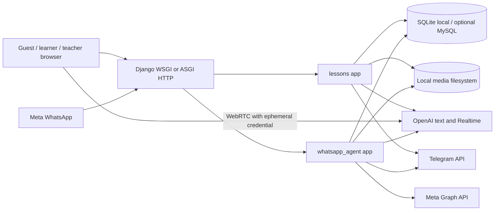
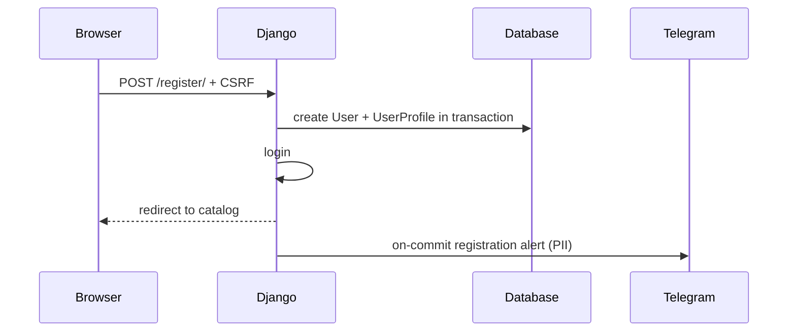
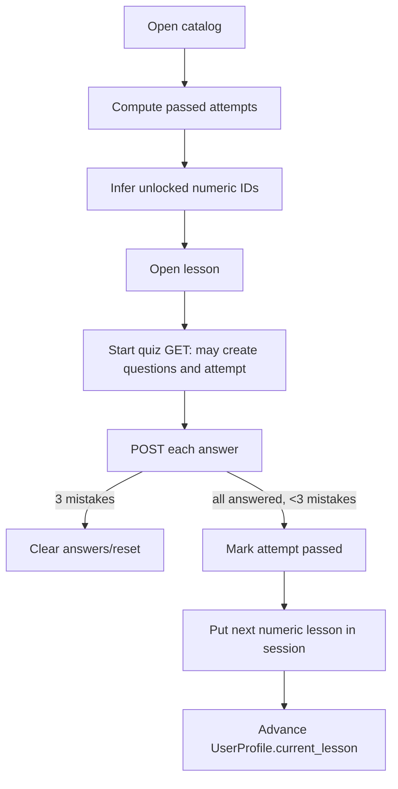
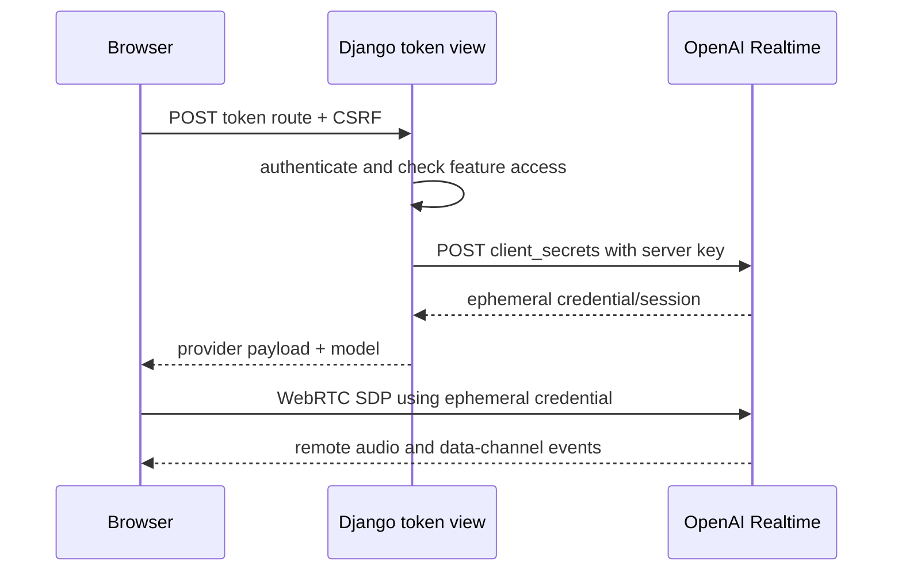
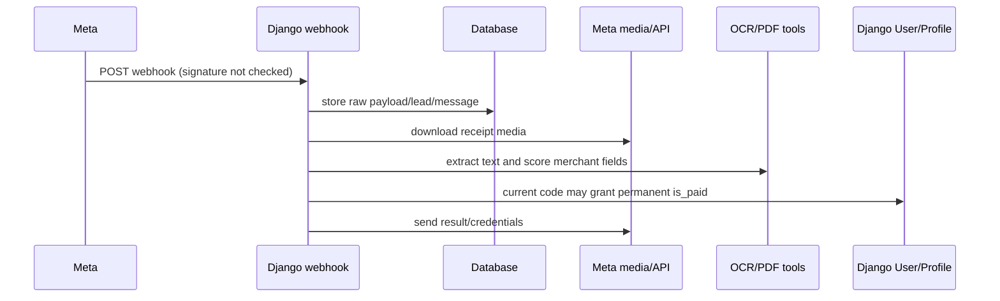
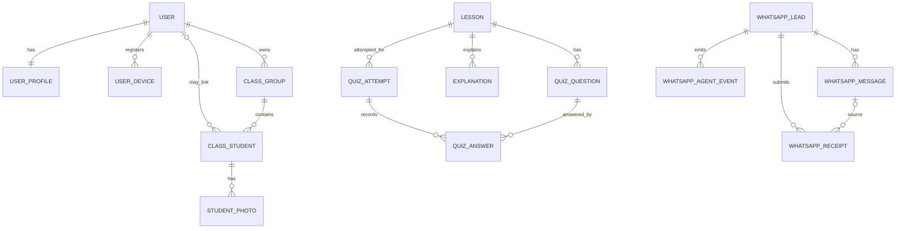
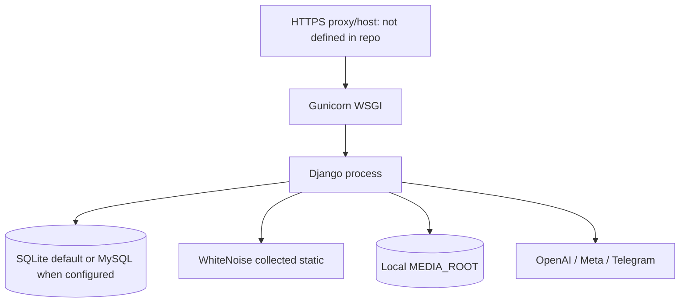

# Architecture and codebase map

Audit snapshot: 2026-07-10. This describes tracked code plus explicitly labeled local evidence. It is not a production topology claim.

## System at a glance

OqyAI is a server-rendered Django monolith. `lessons` owns most product domains; `whatsapp_agent` owns messaging records but directly changes course entitlement. Browser voice/classroom/translator clients connect directly to OpenAI Realtime after Django mints ephemeral credentials.

`Confirmed / High`: `english_course/urls.py`, `settings.py`, `realtime.py`, `lessons/views*.py`, and `whatsapp_agent/services.py`.

## Architectural style and boundaries

| Boundary | Current responsibility | Coupling and change risk |
| --- | --- | --- |
| `english_course` | Settings, root URLs, WSGI/ASGI, Realtime helpers/TTS, Telegram transport | Single settings module mixes dev/prod and requires OpenAI at import; external clients are not uniformly configured |
| `lessons` | Accounts/profile, entitlements, content, quizzes, explanations, chat, voice, translator, PWA, leads, classroom | A domain monolith; `views.py` is 1,457 lines and combines policy, persistence, paid APIs, files, and presentation |
| `whatsapp_agent` | Leads/messages/events/receipts, sales replies, Meta API, OCR, provisioning, Telegram escalation | `services.py` is 1,301 lines and directly mutates `UserProfile`; payment proof, messaging, identity, and entitlements are coupled |
| Templates/static | Full server-rendered UX and large browser Realtime/classroom clients | Multiple standalone design systems, inline JS/CSS, CDNs, and backend route assumptions |

The architecture is practical for a small product but lacks stable domain services for entitlement, payment, curriculum, AI requests, private files, and webhook processing. See `ARCH-001`–`ARCH-003` in [the backlog](BACKLOG.md).

## Repository navigation and change impact

| Path | Purpose and major interfaces | Callers/dependencies | Modification risks | Related docs |
| --- | --- | --- | --- | --- |
| `manage.py` | Django command entry | Settings import | Every command currently requires OpenAI config and emits a banner | Environment/testing |
| `english_course/settings.py` | Apps, middleware, database, auth, static/media, logging, integrations | All Django processes | Secrets, insecure defaults, local/prod coupling, import side effects | Environment/security |
| `english_course/urls.py` | Admin, WhatsApp, lessons route roots | Django | Route order and debug media serving | This document |
| `english_course/asgi.py`, `wsgi.py` | HTTP process entry points | Hosting/Gunicorn | ASGI is intentionally HTTP-only; Channels is unused | Environment |
| `english_course/realtime.py` | Realtime session payload, safety hash, client-secret mint | All three token views | Credential exposure, provider contract, timeout/error logging | AI/contracts |
| `english_course/utils/realtime_tts.py` | Backend Realtime WebSocket PCM→MP3 | `explain_section` | External binary, unbounded response time, event-shape drift | AI/contracts |
| `english_course/services/telegram.py` | Shared bounded Telegram send | Registration/WhatsApp alerts | PII egress and operational dependency | Security/environment |
| `lessons/models.py` | Lesson, quiz, explanation, profile/access, device, lead, classroom data | Views/admin/WhatsApp | Central schema and hard-coded business semantics | Data model/content |
| `lessons/views.py` | Catalog, lesson, auth registration, explanations, chat, quizzes, PWA, profile, translator/voice tokens | `lessons/urls.py`, templates/JS | Highest general change risk; pre-existing voice-prompt WIP | AI/technical/UX |
| `lessons/views_classroom.py` | Teacher ownership, roster/upload/embedding/session/token endpoints | Classroom templates/JS | Minors/biometrics, files, OpenAI disclosure, access | Classroom/security |
| `lessons/middleware.py` | Device registration/locking and canonical-host redirect | Every authenticated request | Account denial-of-service, DB query cost, cookie semantics | Security/technical |
| `lessons/forms.py` | Registration/phone/role | `register` | Identity and teacher authorization | Security/UX |
| `lessons/forms_classroom.py` | Classroom group/student/photos/session | Classroom views | Upload limits and partial writes | Classroom/security |
| `lessons/admin.py` | Lesson/profile/device/lead admin | Staff | Powerful access actions; incomplete content/classroom graph | Access/content |
| `lessons/migrations/` | Current schema history | Deployments/tests | Local DB contains an extra applied migration not in Git; do not infer production | Environment/data |
| `lessons/fixtures/` | Content plus unsafe runtime snapshots | `loaddata`/content operations | All invalid JSON; several contain private data and conflict with current constraints | Content/security |
| `lessons/templates/lessons/` | Product pages | Views; Bootstrap/CDNs | Large standalone templates, XSS sinks, accessibility/price contradictions | UX/security |
| `static/js/voice-lesson.js` | Individual Realtime WebRTC UI | Lesson detail/token API/OpenAI | Cost, browser permissions, event contract | AI/contracts |
| `static/js/translator-assistant.js` | Translator Realtime UI | Catalog/token API/OpenAI | Cost, modal accessibility, language inference | AI/UX |
| `static/js/classroom-lesson.js` | Camera/face/hand/voice classroom runtime | Classroom session/CDNs/OpenAI | 2,261-line experimental biometric client | Classroom/security |
| `static/js/classroom-voice-enroll.js` | Browser voice embedding enrollment | Group detail/embedding endpoint | Duplicate logic and biometric lifecycle | Classroom |
| `static/sw.js` | Cache/offline/PWA hooks | Service worker view/register script | Private/stale page caching and missing precache asset | Security/UX |
| `whatsapp_agent/models.py` | Lead/message/event/receipt persistence | Services/admin | Raw PII duplication, no retention/idempotency uniqueness | Security/AI |
| `whatsapp_agent/views.py` | Meta GET handshake and POST webhook | Meta/public internet | Missing POST signature boundary | Security |
| `whatsapp_agent/services.py` | Entire sales/payment/provisioning pipeline | Webhook/commands/admin | Payment fraud, credentials, recipient mutation, sync latency | Security/AI |
| `whatsapp_agent/utils.py` | Phone/intent/OCR/receipt heuristics | Services | Heuristic is not payment verification; resource limits | Security/technical |
| `requirements.txt` | Python dependency declaration | Dev/deploy | Not a reproducible lock; installed environment differs | Environment |
| `Procfile` | Gunicorn WSGI command | Procfile host | No release/worker/health/timeouts | Environment |
| `analyze_lessons.py` | Orphaned PostgreSQL analysis script | No active callers found | Contains a tracked credential; do not execute | Security/content |

## HTTP interfaces

Route definitions are in `lessons/urls.py` and `whatsapp_agent/urls.py`.

| Area | Important routes | Current server guard |
| --- | --- | --- |
| Catalog/lesson | `/`, `/lesson/<id>/`, `/vocabulary/` | Mixed guest/session/paid checks; global vocabulary requires login but ignores entitlement |
| Auth/profile | `/register/`, `/login/`, `/logout/`, `/profile/`, `/account-locked/` | Django auth/CSRF; no reset/rate limit/phone verification |
| Quiz | `/start-quiz/<id>/`, `/submit-answer/<id>/` | Submit requires POST+CSRF; neither enforces lesson entitlement |
| AI text/audio | `/lesson/<id>/explain-section/`, `/chat-with-gpt/<id>/`, `/motivational-message/` | Explanation superuser-only; chat/motivation public and unmetered |
| Realtime | `/api/realtime/token/<id>/`, `/api/translator/token/`, classroom token route | Feature/profile checks; no server-side usage ledger |
| Classroom | `/classroom/...` | Login + self-selected teacher; object ownership filters are present; live session also requires voice access |
| WhatsApp | `/api/whatsapp/webhook/` | GET verify-token handshake; POST currently unauthenticated |
| PWA | `/sw.js`, `/manifest.json` | Public file reads from collected-static directory |

## Major request and event flows

### Registration and access

Registration stores the public role choice. Paid, voice, and translator access are separate profile state. Course access does not expire. Middleware may create/lock device state on every authenticated request.

### Lesson progression

Quiz idempotency is materially better than surrounding access policy and is covered by tests. The current database cannot enforce that an answer's question belongs to the attempt's lesson; the view does.

### Realtime voice/translator/classroom

Individual voice currently uses a pre-existing worktree prompt change that is not lesson-grounded. Classroom includes school/class/student names in instructions. Browser time limits are not a server cost boundary.

### WhatsApp receipt/provisioning

This is a vulnerability diagram, not an approved payment design. Implement `SEC-001` before relying on the flow.

## Conceptual data model

There is only a string phone comparison—not a foreign key or verified identity—between `WhatsAppLead` and `UserProfile`.

### Current entities and invariants

| Entity | Confirmed invariant | Missing/weak invariant |
| --- | --- | --- |
| `Lesson` | Five required content text fields | Explicit track/language/level/order/free/published/version/prerequisite |
| `QuizQuestion` | Belongs to a lesson | Uniqueness, authored/derived provenance, content version |
| `QuizAttempt` | Unique `(user_id, lesson)` | Real user FK/anonymous identity type; answer-derived state consistency |
| `QuizAnswer` | Unique `(attempt, question)` | DB-level same-lesson guarantee |
| `Explanation` | Unique `(lesson, section)` | Source lesson hash, model/prompt version, generation state, managed audio file |
| `UserProfile` | One-to-one user | Unique verified canonical phone; auditable/expiring course entitlement |
| `UserDevice` | Unique `(user, device_id)` | Trustworthy device identity, refreshed `last_seen`, self-service revoke |
| `ClassGroup` | Unique teacher/school/name; teacher ownership filters | Verified teacher/school authority |
| `ClassStudent`/`StudentPhoto` | Group ownership enforced in views | Consent, guardian, retention, per-file deletion/audit |
| `WhatsAppLead` | Unique normalized phone string | Verified account binding and retention |
| `WhatsAppMessage` | Provider ID indexed | Unique provider ID/idempotent processing state |
| `WhatsAppReceipt` | Stores extraction/scoring | Transaction identity, uniqueness, payer/currency/status/freshness, approval audit |

## Access and entitlement matrix

| Capability | Guest | Unpaid student | Paid student | Teacher | Staff/superuser |
| --- | --- | --- | --- | --- | --- |
| Catalog/free lessons | Yes | Yes | Yes | Yes | Yes |
| Main paid lessons | No | No | Yes | Only if separately paid | Yes by account state, not an automatic staff bypass everywhere |
| Quiz endpoints | Currently callable beyond page gating | Currently callable | Yes | Callable | Yes |
| Global vocabulary | No | Yes, including locked content | Yes | Yes | Yes |
| Lesson chat/motivation | Public endpoint | Yes | Yes | Yes | Yes |
| Voice | No | Separate active flag required | Separate active flag required | Separate active flag required | Profile behavior unless manually provisioned |
| Translator | No | Separate active flag required | Separate active flag required | Separate active flag required | Profile behavior unless provisioned |
| Classroom management | No | No | No unless role teacher | Yes immediately after self-select | Only if profile role/normal auth path |
| Classroom live | No | No | No | Teacher + active voice | Same profile rule |
| Explanation generation | No | No | No | No | Superuser only |

This matrix describes code, not intended policy. Centralization is `ARCH-001`.

## Deployment shape

No worker, queue, shared/object media, cache service, health endpoint, CI, metrics, error tracker, or repository-defined backup system is present. Channels' in-memory layer is configured but no active websocket routes exist.

## High-risk modification map

- Payment/WhatsApp: can grant access, leak credentials, or message real users. Always mock external sends; never test live without explicit authorization.
- Profile/access/middleware: duplicated policy can create IDOR/paywall bypass or lock users out.
- Lesson IDs/content imports: IDs encode order, track, level, free access, progress, and URLs.
- Quiz migrations/state: preserve uniqueness and legacy pass records; do not delete questions on quiz start.
- Explanation/media: current regeneration deletes files before successful replacement.
- Realtime: standard API key must remain server-only; prompt/model/event changes affect cost and behavior.
- Classroom: ownership checks are present, but privacy/consent and file lifecycle are not.
- Service worker: caching changes can expose authenticated responses or make stale state authoritative.

## Architecture decisions still required

- Canonical production host/database/media topology and operational owner.
- Payment/entitlement source and verified transaction mechanism.
- Teacher and school verification model.
- Curriculum track/language/order/publication model.
- Private object storage and data retention/deletion requirements.
- Worker/queue choice after the fail-closed security work—not before.
- Whether classroom is a product, a pilot, or a research prototype.
