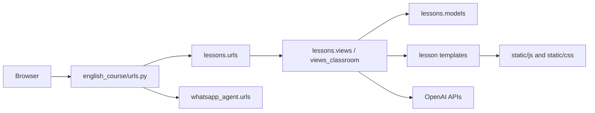
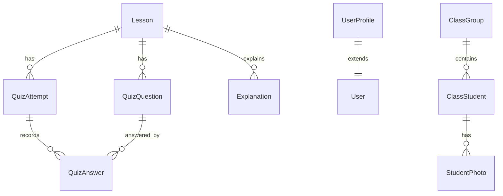
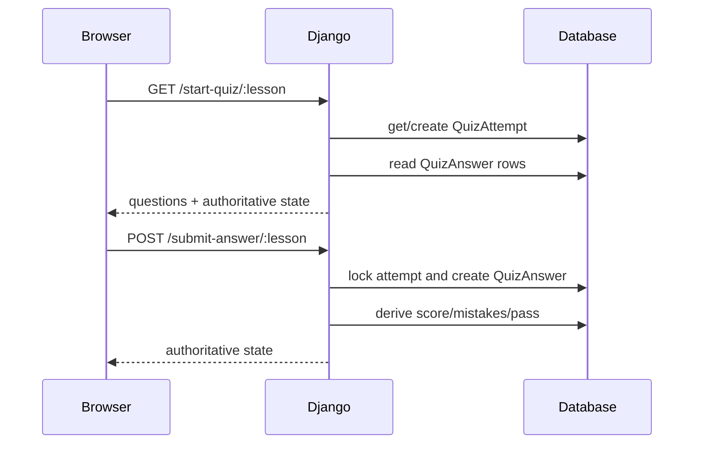
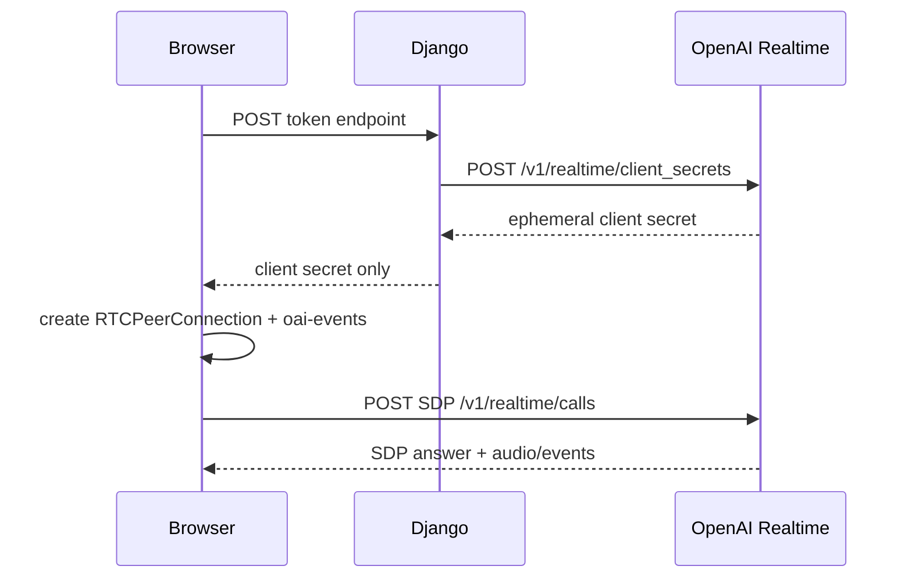

# Architecture And Data Flow

## Request Lifecycle
1. Browser request enters Django through `english_course/urls.py`.
2. Root product routes are delegated to `lessons/urls.py`.
3. WhatsApp webhook routes are delegated to `whatsapp_agent/urls.py`.
4. Middleware applies domain redirect, sessions/auth, CSRF, messages, clickjacking, and device lock checks.
5. Views load models, enforce access, render templates, or return JSON.
6. Static assets are served by Django/WhiteNoise after `collectstatic`; media files are served from `MEDIA_ROOT`.

## Apps And Responsibilities
- `english_course`: project configuration, ASGI/WSGI, shared Realtime helpers, Realtime TTS utility.
- `lessons`: course content, quizzes, explanation generation, auth-adjacent access logic, profile, voice/translator/classroom features.
- `whatsapp_agent`: isolated WhatsApp Cloud API sales conversations, receipt parsing, Telegram escalation, paid-course provisioning.

## Database Entities
- `Lesson`: authored lesson content: title, content, vocabulary, grammar, dialogue.
- `QuizQuestion`: generated or stored question row for a lesson.
- `QuizAttempt`: one row per `user_id + lesson`; stores score, mistakes, completion, pass state.
- `QuizAnswer`: one row per `attempt + question`; stores selected answer, correctness, timestamp.
- `Explanation`: one row per `lesson + section`; stores generated text and audio URL.
- `UserProfile`: access flags, role, current lesson, lock state, phone.
- `UserDevice`: device-limit enforcement.
- `Lead`: simple marketing lead.
- `ClassGroup`, `ClassStudent`, `StudentPhoto`: classroom WIP data.

## Authentication And Session Handling
- Django auth is the account system.
- Registration creates `UserProfile`.
- Authenticated quiz identity is `str(request.user.id)`.
- Guest quiz identity is the Django session key; the session is created before use.
- Device lock middleware can lock and log out authenticated users with too many devices.
- Premium features check `UserProfile` helper methods, not only raw boolean fields.

## Lesson Progression
- `lesson_list()` computes unlocked lessons from passed `QuizAttempt` rows, session `passed_lessons`, and paid/free access.
- `lesson_detail()` gates locked lessons and renders explanations plus voice UI state.
- Passing a quiz updates `QuizAttempt.is_passed`, session `passed_lessons`, and authenticated `UserProfile.current_lesson` once.
- Free lesson IDs remain `{1, 2, 3, 251, 252, 253}`.

## Quiz Lifecycle
1. Browser opens lesson detail and clicks Start Quiz.
2. `start_quiz()` ensures questions exist, creates/resumes the one attempt, returns questions, answered IDs, score, mistakes, pass state, and next unanswered ID.
3. Browser renders the first unanswered question.
4. `submit_answer()` requires POST and CSRF, validates that the question belongs to the current lesson, and stores one `QuizAnswer` per question.
5. Score and mistakes are derived from stored answers.
6. Three distinct wrong answers reset the attempt and delete stored answers.
7. Passing requires all distinct lesson questions answered with fewer than three mistakes.

## Explanation Generation Lifecycle
1. Superuser posts a section to `/lesson/<id>/explain-section/`.
2. Django generates explanation text with OpenAI text APIs.
3. Django calls `synthesize_audio_realtime_mp3()` with a safety identifier.
4. The TTS utility connects from the backend to GA Realtime WebSocket.
5. It sends `session.update`, a user conversation item, and `response.create`.
6. It collects `response.output_audio.delta`, converts PCM to MP3, and returns bytes.
7. The view deletes old generated MP3s for that lesson section, writes the new MP3 under `MEDIA_ROOT`, and updates `Explanation`.

## Media And Static Lifecycle
- Source static: `static/`.
- Collected static: `staticfiles/`.
- Generated media: `media/` locally unless `MEDIA_ROOT` is set.
- `sw.js` and `manifest.json` are read from collected static output.
- `staticfiles/`, `media/`, and `db.sqlite3` are local/generated and must not be committed.

## Browser To Django To OpenAI Realtime Flow
1. Browser asks Django token endpoint for a feature-specific ephemeral credential.
2. Django validates access and posts to `https://api.openai.com/v1/realtime/client_secrets`.
3. Django includes a SHA-256 `OpenAI-Safety-Identifier`.
4. Browser receives only the ephemeral client secret payload.
5. Browser creates `RTCPeerConnection` and one data channel named `oai-events`.
6. Browser posts SDP to `https://api.openai.com/v1/realtime/calls` using the ephemeral credential.
7. Browser handles GA events such as `response.output_text.delta`, `response.output_audio_transcript.delta`, `response.output_audio_transcript.done`, `response.done`, and `error`.

## Classroom And Translator Flow
- Translator:
  - `lesson_list.html` configures `TranslatorAssistant`.
  - Access check is `/api/translator/check-access/`.
  - Token minting is `/api/translator/token/`.
  - Browser WebRTC flow is in `static/js/translator-assistant.js`.
- Classroom:
  - Teacher pages live in `lessons/views_classroom.py`.
  - Session page serializes roster/photo/voice metadata.
  - `ClassroomLessonManager` extends the voice lesson client.
  - Classroom token minting is `/api/realtime/classroom/<lesson_id>/<group_id>/`.
  - Browser-side camera/voice processing handles face, hand, voice, attendance, and control events.

## Production Versus Local Differences
- Local database defaults to SQLite at `db.sqlite3`.
- Production can use MySQL only when `USE_MYSQL=1` and `MYSQL_*` variables are set.
- Local media defaults to `<repo>/media`.
- Production media path should be set through `MEDIA_ROOT`.
- Local/dev static source is in `static/`; production must run `collectstatic`.
- Real browser microphone/camera features require HTTPS outside localhost.
- WSGI is the declared production entrypoint; active Realtime browser flows do not depend on Django websocket routing.
