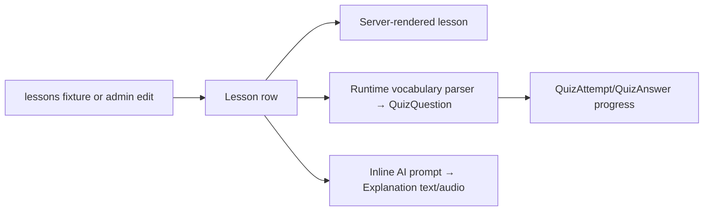

# Educational content and fixture operations

Audit snapshot: 2026-07-10. No fixture or database data was changed.

## Current lesson representation

`Lesson` contains five required fields: `title`, `content`, `vocabulary`, `grammar`, and `dialogue`, plus creation time. Quiz questions and explanations are separate rows. The model has no track/language, CEFR level, order, objective, estimated duration, prerequisite, free/premium flag, draft/published state, version, author, reviewer, or content hash.



Changing lesson text can make existing questions and explanations stale. No system records that relationship.

## Evidence snapshot

Safe aggregate inspection of tracked fixtures found:

- `lessons/fixtures/lessons.json`: 300 records, IDs 1–300 with no gaps; all five content fields non-empty.
- IDs 1–250 are the main catalog; IDs 251–300 appear to be a 50-lesson Russian-localized parallel set. Product status is `Needs product-owner confirmation`.
- The web catalog creates five 50-lesson stages from the first 250 ordered rows and therefore does not expose the additional 50 through the stage list.
- 48 extra duplicate titles/content values and 50 duplicate dialogues are consistent with the localized parallel set, not enough evidence by itself to label them content defects.
- Every fixture lesson had at least four lines parseable by the exact quiz delimiter `" – "`; individual undelimited lines can still be silently skipped.
- `quiz_questions.json`: 1,042 rows; coverage is partial and runtime can generate rows.
- `explanations.json`: 227 rows across 59 lessons; most lessons have no stored explanation in this snapshot.
- Local ignored `db.sqlite3` held 250 lessons, not 300. The local database is not a source of production truth.

## Critical fixture condition

Every tracked JSON fixture begins with a settings-import console banner before `[` and is invalid JSON from byte zero. Root cause: `english_course/settings.py` prints during Django setup. `Confirmed / High`.

Tracked fixture categories:

| Path | Category | Safe disposition |
| --- | --- | --- |
| `lessons.json` | Authored content candidate | Preserve pending canonical-source decision; regenerate valid JSON |
| `quiz_questions.json` | Derived/frozen quiz content | Do not hand-edit without content/version policy |
| `explanations.json` | Generated AI output and media references | Treat as generated/stale-prone; review before retaining |
| `leads.json` | Private marketing runtime snapshot | Remove from current repository through `CONTENT-001`; preserve only authorized secure backup |
| `user_profiles.json` | Private account/access snapshot | Same; contains private identifiers and duplicate-phone groups |
| `user_devices.json` | Private device snapshot | Same |
| `quiz_attempts.json` | Private progress/session snapshot | Same; includes data conflicting with current uniqueness and no answer fixture |

Do not run `loaddata` against these files. Do not copy their private values into issues or documentation.

## Source-of-truth decision

The repository does not establish whether authored lessons live primarily in Git fixtures or the production database/admin. `Needs product-owner confirmation`.

Until `CONTENT-001`/`DATA-004`:

- preserve lesson IDs;
- do not bulk-import, export, reorder, delete, or publish content;
- do not treat local DB counts as production;
- never create fixtures from an unfiltered production dump;
- use aggregate validation and sanitized test data only.

## Current quiz-content contract

`generate_quiz_questions()`:

1. exits if any question already exists for the lesson;
2. splits vocabulary into lines;
3. accepts only lines with the exact spaced en-dash delimiter;
4. bulk-creates questions during a GET quiz-start request.

Consequences:

- edited vocabulary never updates existing questions;
- one existing question blocks generation of missing questions;
- concurrent first starts can create duplicates because no question uniqueness constraint exists;
- content format errors silently reduce the quiz;
- deleting questions can invalidate answer history/progress.

Quiz attempts/answers are now authoritative, but historical attempt fixtures predate/omit `QuizAnswer` evidence. Restore behavior therefore needs an explicit legacy policy.

## Current explanation contract

- One `Explanation` is unique per lesson/section.
- Text and MP3 are generated synchronously by a superuser action.
- The row stores an `audio_url` string rather than a managed file field.
- Regeneration deletes matching old MP3s before the replacement is safely committed.
- No lesson content hash, model, prompt version, reviewer, or generation status is stored.
- AI text is currently rendered with `|safe`, creating `SEC-006`.

## Admin and bulk-management gaps

Only `Lesson` is registered for course authoring. Quiz questions/answers/attempts, explanations, classroom entities, and content validation are not registered. There is no:

- preview/diff/approval/publish workflow;
- role-separated author/reviewer;
- atomic import with dry run;
- export manifest/version;
- duplicate or near-duplicate detector;
- language/CEFR/format validation;
- stale question/explanation detector;
- rollback to a content version;
- learner-progress impact report.

## Safe future workflow

This is recommended architecture, not implemented behavior.

1. Define explicit curriculum metadata and stable public IDs (`DATA-004`).
2. Choose one canonical authored source: versioned database revisions or validated repository packages.
3. Add a dry-run validator that checks schema, IDs, track/order, required fields, delimiter normalization, duplicates, encoding, quiz/explanation impact, and private data.
4. Import into a staging revision inside a transaction; never mutate published rows piecemeal.
5. Preview/diff and require reviewer approval.
6. Publish by version; keep learner attempts linked to the content/question version they saw.
7. Queue bounded explanation/audio regeneration and keep old artifacts until the new version succeeds.
8. Export only authored content, with a manifest/checksum and no runtime/user data.
9. Test restore in a disposable database before operational use.

## Minimum validation rules

- Valid UTF-8 JSON from byte zero; no stdout banner.
- Allowed model labels and expected fields only.
- Stable unique content ID plus explicit track/order.
- Non-empty title/content/vocabulary/grammar/dialogue.
- Vocabulary parser produces the expected number of normalized entries and reports rejected lines.
- No duplicate normalized vocabulary within a lesson unless explicitly waived.
- No duplicate track/order or published slug.
- Quiz questions remain attached to the same lesson version.
- Explanation source hash/version matches or is marked stale.
- No user, phone, device, receipt, message, credential, or session data.

## Content quality review

Automated checks can detect completeness, formatting, duplication, language anomalies, broken references, unsafe HTML, and answer ambiguity. They cannot establish pedagogy, translation quality, cultural appropriateness, CEFR accuracy, pronunciation quality, or learning outcomes. Those require a qualified Kazakh/English reviewer and learner evidence.

Current KPI baselines—content defect rate, completion by lesson/version, question ambiguity, explanation usefulness—`Need analytics data`.

## Operational commands after remediation

Do not use these against current contaminated/private fixtures. A future safe workflow should provide project commands such as:

```text
manage.py validate_content <package> --dry-run
manage.py import_content <package> --revision <id> --dry-run
manage.py export_authored_content --revision <id> --output <safe-path>
```

These commands do not exist today. Never invent/run them until their backlog task is implemented.

## Task links

- `CONTENT-001`: remove private runtime fixtures and create valid sanitized authored/test fixtures.
- `CONTENT-002`: content validation/dry-run and quality report.
- `DATA-004`: explicit curriculum/order/language/publication schema.
- `DATA-005`: content/explanation provenance and safe media replacement.
- `FEAT-004`: versioned authoring and content-QA workspace.
